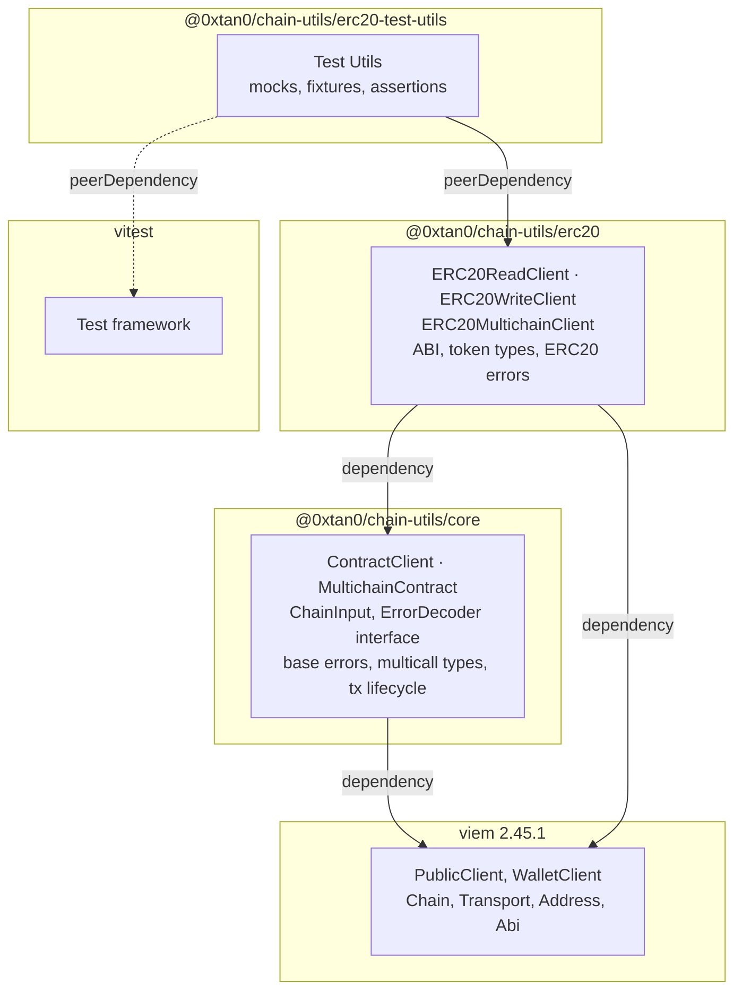
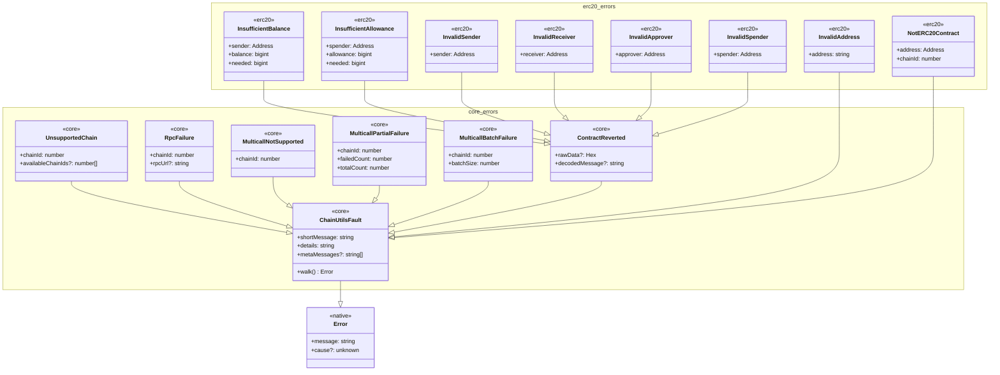
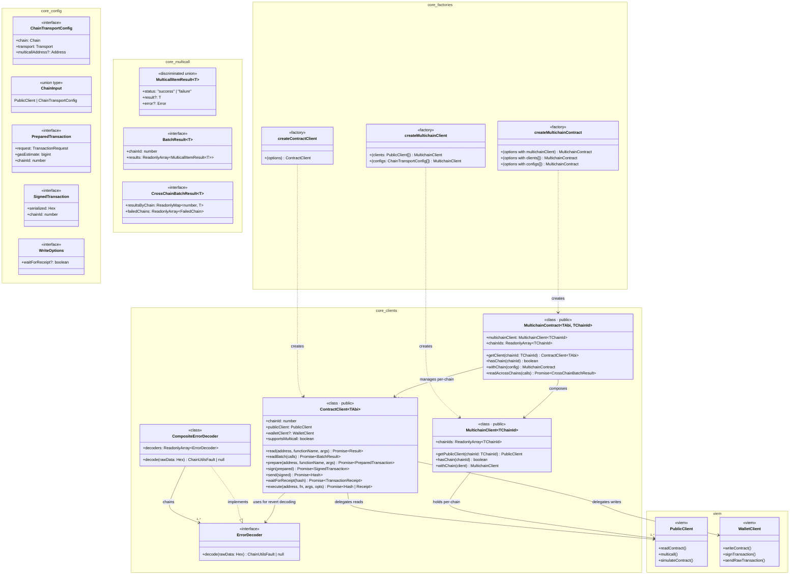

# ERC20 Multichain Utility Package — Technical Design

> **Status:** Design Phase
> **Scope:** ERC20 standard (first iteration). Architecture supports future ERC721/ERC1155.
> **Stack:** TypeScript, viem 2.45.1, Turborepo monorepo

---

## Table of Contents

1. [Overview](#1-overview)
2. [Package Structure](#2-package-structure)
3. [Core Package — Generic Layer](#3-core-package--generic-layer)
4. [ERC20 Package — Domain Layer](#4-erc20-package--domain-layer)
5. [ERC20 Test Utils Package](#5-erc20-test-utils-package)
6. [Type-Safe Multichain Pattern](#6-type-safe-multichain-pattern)
7. [Error Hierarchy](#7-error-hierarchy)
8. [On-Chain Revert Decoding](#8-on-chain-revert-decoding)
9. [Class Diagrams](#9-class-diagrams)
10. [Sequence Diagrams](#10-sequence-diagrams)
11. [Exported Public API](#11-exported-public-api)
12. [Design Considerations](#12-design-considerations)

---

## 1. Overview

A set of npm packages providing viem-based utilities for EVM smart contract integrations, starting with ERC20 multichain support.

**Goals:**

- Easy access to any ERC20 token on any supported chain
- Native multicall support for batching reads in a single RPC round-trip
- Full transaction lifecycle: prepare, sign, send, wait
- Type-safe chain IDs enforced at compile time
- Pluggable error decoding for on-chain reverts
- Reusable generic core (`ContractClient`, `MultichainContract`) for any ABI — not just ERC standards

**Non-Goals (this iteration):**

- ERC721 / ERC1155 implementations (architecture supports them, but not built yet)
- Event watching / subscription APIs
- Gas price oracle / fee estimation strategies

---

## 2. Package Structure

### 2.1 Packages

| Package | Path | Purpose |
|---------|------|---------|
| `@0xtan0/chain-utils/core` | `packages/core` | Generic building blocks: `ContractClient<TAbi>`, `MultichainContract<TAbi, TChainId>`, `ChainInput`, base errors, multicall types, transaction lifecycle, `ErrorDecoder` interface |
| `@0xtan0/chain-utils/erc20` | `packages/erc20` | ERC20-specific: ABI, typed clients (`ERC20ReadClient`, `ERC20WriteClient`, `ERC20MultichainClient`), token data types, ERC20 error decoder |
| `@0xtan0/chain-utils/erc20-test-utils` | `packages/erc20-test-utils` | Test helpers: mock client factories, token/chain fixtures, vitest assertion helpers |

### 2.2 Directory Layout

Each package follows the `create-package.sh` conventions:

```
packages/core/
  src/
    index.ts                # Re-exports from external.ts
    external.ts             # Public API surface
    internal.ts             # Internal utilities (not exported)
    types/
      config.ts             # ChainTransportConfig, ChainInput
      multicall.ts          # MulticallItemResult, BatchResult, CrossChainBatchResult
      transaction.ts        # PreparedTransaction, SignedTransaction
    client/
      multichainClient.ts   # MultichainClient<TChainId> — RPC connections per chain (no ABI)
      contractClient.ts     # ContractClient<TAbi> class
      multichainContract.ts # MultichainContract<TAbi, TChainId> class
    errors/
      base.ts               # ChainUtilsFault
      chain.ts              # UnsupportedChain, RpcFailure, MulticallNotSupported
      multicall.ts          # MulticallPartialFailure, MulticallBatchFailure
      revert.ts             # ContractReverted (generic)
    decoder/
      errorDecoder.ts       # ErrorDecoder interface
      compositeDecoder.ts   # CompositeErrorDecoder (chain of responsibility)
  test/
    multichainClient.spec.ts
    contractClient.spec.ts
    multichainContract.spec.ts
    errors.spec.ts

packages/erc20/
  src/
    index.ts
    external.ts
    internal.ts
    abi/
      erc20Abi.ts           # Standard ERC20 ABI (typed const)
      erc20ErrorsAbi.ts     # OZ v5 custom error ABI fragments
    types/
      token.ts              # TokenReference, TokenMetadata, TokenBalance, TokenAllowance
      query.ts              # BalanceQuery, AllowanceQuery
      client.ts             # ERC20ReadClient, ERC20WriteClient, ERC20MultichainClient interfaces
      options.ts            # ERC20ClientOptions, ERC20WriteClientOptions, ERC20MultichainClientOptions
    client/
      erc20ReadClient.ts    # ERC20ReadClient class (composes ContractClient<erc20Abi>)
      erc20WriteClient.ts   # ERC20WriteClient class (extends read, adds write lifecycle)
      erc20MultichainClient.ts # ERC20MultichainClient class (composes MultichainContract)
    errors/
      contract.ts           # InvalidAddress, NotERC20Contract
      revert.ts             # InsufficientBalance, InsufficientAllowance, etc.
    decoder/
      erc20ErrorDecoder.ts  # ERC20ErrorDecoder (implements ErrorDecoder)
    token/
      tokenDefinition.ts    # TokenDefinition<TChainId> — pure data (addresses, no RPC)
      tokenBuilder.ts       # defineToken() factory + builder chain
      common.ts             # Pre-built definitions: USDC, DAI, USDT, WETH
      erc20Token.ts         # ERC20Token<TChainId> — bound token (addresses + RPC)
      erc20TokenBuilder.ts  # ERC20TokenBuilder — builds ERC20Token from MultichainClient
  test/
    erc20ReadClient.spec.ts
    erc20WriteClient.spec.ts
    erc20MultichainClient.spec.ts
    erc20ErrorDecoder.spec.ts
    erc20Token.spec.ts
    erc20TokenBuilder.spec.ts

packages/erc20-test-utils/
  src/
    index.ts
    external.ts
    internal.ts
    mocks/
      mockPublicClient.ts
      mockWalletClient.ts
      mockERC20Responses.ts
    fixtures/
      tokens.ts             # USDC, DAI, USDT, WETH with real metadata
      chains.ts             # Mock chain definitions
    helpers/
      assertions.ts         # Custom vitest assertion helpers
      setup.ts              # One-liner test setup factories
  test/
    index.spec.ts
```

### 2.3 Package Dependency Graph



---

## 3. Core Package — Generic Layer

The core package provides standard-agnostic building blocks that any contract standard (ERC20, ERC721, ERC1155, or custom) can compose. Users can also use these directly for any ABI.

### 3.1 Configuration Types

```typescript
// packages/core/src/types/config.ts

import type { Address, Chain, PublicClient, Transport } from "viem";

/**
 * Shorthand for when the user doesn't want to create a PublicClient themselves.
 * The library creates the client internally from chain + transport.
 *
 * When you already have a PublicClient, pass it directly — no wrapper needed.
 * The chain is already embedded in PublicClient.chain.
 */
export interface ChainTransportConfig {
    readonly chain: Chain;
    readonly transport: Transport;
    readonly multicallAddress?: Address;
}

/**
 * What the factories accept: either a pre-built PublicClient
 * (chain is already in client.chain) or a ChainTransportConfig shorthand.
 */
export type ChainInput = PublicClient<Transport, Chain> | ChainTransportConfig;
```

### 3.2 Transaction Lifecycle Types

```typescript
// packages/core/src/types/transaction.ts

import type { Hex, TransactionRequest } from "viem";

/**
 * Result of a prepare step: simulated tx + gas estimate.
 * Ready to be signed, but NOT yet signed or sent.
 */
export interface PreparedTransaction {
    readonly request: TransactionRequest;
    readonly gasEstimate: bigint;
    readonly chainId: number;
}

/**
 * A signed transaction, serialized as hex bytes.
 * Ready to be broadcast, but NOT yet sent.
 */
export interface SignedTransaction {
    readonly serialized: Hex;
    readonly chainId: number;
}

/**
 * Options for convenience write methods.
 */
export interface WriteOptions {
    /** If true, wait for the tx to be mined and return the receipt. Default: false. */
    readonly waitForReceipt?: boolean;
}
```

### 3.3 Multicall Types

```typescript
// packages/core/src/types/multicall.ts

/**
 * Discriminated union for a single result within a multicall batch.
 * Mirrors viem's MulticallResponse pattern.
 */
export type MulticallItemResult<T> =
    | { readonly status: "success"; readonly result: T }
    | { readonly status: "failure"; readonly error: Error };

/**
 * Results of a batch operation on a single chain.
 */
export interface BatchResult<T> {
    readonly chainId: number;
    readonly results: ReadonlyArray<MulticallItemResult<T>>;
}

/**
 * Aggregated result from a cross-chain batch operation.
 */
export interface CrossChainBatchResult<T> {
    readonly resultsByChain: ReadonlyMap<number, T>;
    readonly failedChains: ReadonlyArray<{
        readonly chainId: number;
        readonly error: Error;
    }>;
}
```

### 3.4 ErrorDecoder Interface

```typescript
// packages/core/src/decoder/errorDecoder.ts

import type { Hex } from "viem";
import type { ChainUtilsFault } from "../errors/base.js";

/**
 * Interface for decoding raw revert data into typed errors.
 * Implementations follow the chain-of-responsibility pattern:
 * try to decode, return null if unrecognized.
 */
export interface ErrorDecoder {
    decode(rawData: Hex): ChainUtilsFault | null;
}
```

```typescript
// packages/core/src/decoder/compositeDecoder.ts

import type { Hex } from "viem";
import type { ChainUtilsFault } from "../errors/base.js";
import type { ErrorDecoder } from "./errorDecoder.js";

/**
 * Chains multiple ErrorDecoders together.
 * Tries each decoder in order; returns the first non-null result.
 * Falls back to ContractReverted if all decoders return null.
 */
export class CompositeErrorDecoder implements ErrorDecoder {
    constructor(readonly decoders: ReadonlyArray<ErrorDecoder>) {}

    decode(rawData: Hex): ChainUtilsFault | null;
}
```

### 3.5 MultichainClient\<TChainId\>

A lightweight, ABI-agnostic container that holds one viem `PublicClient` per configured chain. This is the lowest-level multichain building block — it manages RPC connections only.

Higher-level constructs (`MultichainContract`, `ERC20TokenBuilder`) compose this.

```typescript
// packages/core/src/client/multichainClient.ts

import type { Chain, PublicClient, Transport } from "viem";
import type { ChainTransportConfig } from "../types/config.js";

/**
 * A typed collection of PublicClients keyed by chain ID.
 *
 * No ABI awareness — just RPC connections.
 * Use this as the entry point for multichain setups,
 * then build token-specific or contract-specific clients on top.
 *
 * TChainId is a union of literal chain IDs captured at creation time.
 */
export class MultichainClient<TChainId extends number> {
    readonly chainIds: ReadonlyArray<TChainId>;

    constructor(clients: ReadonlyMap<TChainId, PublicClient<Transport, Chain>>);

    /** Get the PublicClient for a specific chain. */
    getPublicClient(chainId: TChainId): PublicClient<Transport, Chain>;

    /** Check if a chain is configured. */
    hasChain(chainId: number): boolean;

    /**
     * Returns a new MultichainClient with an additional chain.
     * Immutable — does not mutate the current instance.
     */
    withChain<TNewChainId extends number>(
        client: PublicClient<Transport, Chain>,
    ): MultichainClient<TChainId | TNewChainId>;
}

// ---- Factory functions ----

/** Create from pre-built PublicClients (most common). */
export function createMultichainClient<
    const TClients extends readonly PublicClient<Transport, Chain>[],
>(clients: TClients): MultichainClient<TClients[number]["chain"]["id"]>;

/** Create from ChainTransportConfig array (library creates PublicClients internally). */
export function createMultichainClient<
    const TConfigs extends readonly ChainTransportConfig[],
>(configs: TConfigs): MultichainClient<TConfigs[number]["chain"]["id"]>;
```

**Usage:**

```typescript
import { createPublicClient, http } from "viem";
import { mainnet, optimism, base } from "viem/chains";
import { createMultichainClient } from "@0xtan0/chain-utils/core";

const mainnetClient = createPublicClient({ chain: mainnet, transport: http() });
const opClient = createPublicClient({ chain: optimism, transport: http() });
const baseClient = createPublicClient({ chain: base, transport: http() });

const multichain = createMultichainClient([mainnetClient, opClient, baseClient]);
// Type: MultichainClient<1 | 10 | 8453>

multichain.getPublicClient(1);     // ✅ returns mainnet PublicClient
multichain.getPublicClient(42161); // ❌ type error — arbitrum not configured
```

### 3.6 ContractClient\<TAbi\>

Single-chain generic contract client. Wraps a viem `PublicClient` and optionally a `WalletClient`.

```typescript
// packages/core/src/client/contractClient.ts

import type {
    Abi,
    Address,
    Chain,
    Hash,
    Hex,
    PublicClient,
    TransactionReceipt,
    Transport,
    WalletClient,
} from "viem";
import type { PreparedTransaction, SignedTransaction, WriteOptions } from "../types/transaction.js";
import type { BatchResult, MulticallItemResult } from "../types/multicall.js";
import type { ErrorDecoder } from "../decoder/errorDecoder.js";

export interface ContractClientOptions<TAbi extends Abi> {
    readonly abi: TAbi;
    readonly publicClient: PublicClient<Transport, Chain>;
    readonly walletClient?: WalletClient;
    readonly errorDecoder?: ErrorDecoder;
    readonly multicallBatchSize?: number;
}

/**
 * Generic single-chain contract client.
 *
 * Provides typed read, batch read, and full transaction lifecycle
 * (prepare → sign → send → wait) for any ABI.
 *
 * ERC20/721/1155 clients compose this class to add domain-specific methods.
 * Users can also instantiate it directly for custom contracts.
 */
export class ContractClient<TAbi extends Abi> {
    readonly chainId: number;
    readonly publicClient: PublicClient<Transport, Chain>;
    readonly walletClient?: WalletClient;
    readonly supportsMulticall: boolean;

    constructor(options: ContractClientOptions<TAbi>);

    // ---- Reads ----

    read<TFunctionName extends string>(
        address: Address,
        functionName: TFunctionName,
        args?: ReadonlyArray<unknown>,
    ): Promise<unknown>;

    readBatch(
        calls: ReadonlyArray<{
            address: Address;
            functionName: string;
            args?: ReadonlyArray<unknown>;
        }>,
    ): Promise<BatchResult<unknown>>;

    // ---- Transaction lifecycle ----

    prepare(
        address: Address,
        functionName: string,
        args?: ReadonlyArray<unknown>,
    ): Promise<PreparedTransaction>;

    sign(prepared: PreparedTransaction): Promise<SignedTransaction>;

    send(signed: SignedTransaction): Promise<Hash>;

    waitForReceipt(hash: Hash): Promise<TransactionReceipt>;

    // ---- Convenience write (full pipeline) ----

    execute(
        address: Address,
        functionName: string,
        args?: ReadonlyArray<unknown>,
        options?: WriteOptions,
    ): Promise<Hash | TransactionReceipt>;
}

// ---- Factory function ----

export function createContractClient<TAbi extends Abi>(
    options: ContractClientOptions<TAbi>,
): ContractClient<TAbi>;
```

### 3.7 MultichainContract\<TAbi, TChainId\>

Multichain generic. Manages one `ContractClient<TAbi>` per configured chain. Composes a `MultichainClient<TChainId>` for RPC connection management.

```typescript
// packages/core/src/client/multichainContract.ts

import type { Abi, Chain, PublicClient, Transport } from "viem";
import type { ChainInput } from "../types/config.js";
import type { ChainTransportConfig } from "../types/config.js";
import type { CrossChainBatchResult, BatchResult } from "../types/multicall.js";
import type { ErrorDecoder } from "../decoder/errorDecoder.js";
import type { MultichainClient } from "./multichainClient.js";
import { ContractClient } from "./contractClient.js";

export interface MultichainContractOptions<TAbi extends Abi> {
    readonly abi: TAbi;
    readonly errorDecoder?: ErrorDecoder;
    readonly multicallBatchSize?: number;
}

/**
 * Generic multichain contract client.
 *
 * Composes a MultichainClient<TChainId> for RPC connection management,
 * adding ABI-aware read/write operations on top.
 *
 * Routes operations to the correct single-chain ContractClient
 * based on the chain ID. Type-safe: TChainId is a union of literal
 * chain IDs captured at construction time.
 *
 * ERC20/721/1155 multichain clients compose this class.
 * Users can also use it directly for custom contracts.
 */
export class MultichainContract<TAbi extends Abi, TChainId extends number> {
    /** The underlying RPC connection manager. */
    readonly multichainClient: MultichainClient<TChainId>;

    readonly chainIds: ReadonlyArray<TChainId>;

    constructor(
        options: MultichainContractOptions<TAbi>,
        clients: ReadonlyMap<TChainId, ContractClient<TAbi>>,
    );

    getClient(chainId: TChainId): ContractClient<TAbi>;

    hasChain(chainId: number): boolean;

    /**
     * Returns a new MultichainContract with the additional chain.
     * Immutable — does not mutate the current instance.
     */
    withChain<TNewChainId extends number>(
        config: ChainInput,
        abi: TAbi,
    ): MultichainContract<TAbi, TChainId | TNewChainId>;

    /**
     * Execute reads across multiple chains in parallel.
     * Uses Promise.allSettled — never throws for individual chain failures.
     */
    readAcrossChains(
        calls: ReadonlyArray<{
            chainId: TChainId;
            address: string;
            functionName: string;
            args?: ReadonlyArray<unknown>;
        }>,
    ): Promise<CrossChainBatchResult<BatchResult<unknown>>>;
}

// ---- Factory functions (overloads) ----

/** Create from a MultichainClient (carries type-safe chain IDs). */
export function createMultichainContract<
    TAbi extends Abi,
    TChainId extends number,
>(
    options: MultichainContractOptions<TAbi> & { multichainClient: MultichainClient<TChainId> },
): MultichainContract<TAbi, TChainId>;

/** Create from pre-built PublicClients. */
export function createMultichainContract<
    TAbi extends Abi,
    const TClients extends readonly PublicClient<Transport, Chain>[],
>(
    options: MultichainContractOptions<TAbi> & { clients: TClients },
): MultichainContract<TAbi, TClients[number]["chain"]["id"]>;

/** Create from ChainTransportConfig array (library creates PublicClients internally). */
export function createMultichainContract<
    TAbi extends Abi,
    const TConfigs extends readonly ChainTransportConfig[],
>(
    options: MultichainContractOptions<TAbi> & { configs: TConfigs },
): MultichainContract<TAbi, TConfigs[number]["chain"]["id"]>;
```

---

## 4. ERC20 Package — Domain Layer

The ERC20 package composes core generics with the ERC20 ABI, adding domain-specific types and methods.

### 4.1 ERC20 ABI

```typescript
// packages/erc20/src/abi/erc20Abi.ts

/**
 * Standard ERC20 ABI as a const assertion for full viem type inference.
 *
 * Includes: name, symbol, decimals, totalSupply, balanceOf, allowance,
 *           transfer, transferFrom, approve, Transfer event, Approval event.
 */
export const erc20Abi = [
    // ---- View functions ----
    {
        type: "function",
        name: "name",
        stateMutability: "view",
        inputs: [],
        outputs: [{ name: "", type: "string" }],
    },
    {
        type: "function",
        name: "symbol",
        stateMutability: "view",
        inputs: [],
        outputs: [{ name: "", type: "string" }],
    },
    {
        type: "function",
        name: "decimals",
        stateMutability: "view",
        inputs: [],
        outputs: [{ name: "", type: "uint8" }],
    },
    {
        type: "function",
        name: "totalSupply",
        stateMutability: "view",
        inputs: [],
        outputs: [{ name: "", type: "uint256" }],
    },
    {
        type: "function",
        name: "balanceOf",
        stateMutability: "view",
        inputs: [{ name: "account", type: "address" }],
        outputs: [{ name: "", type: "uint256" }],
    },
    {
        type: "function",
        name: "allowance",
        stateMutability: "view",
        inputs: [
            { name: "owner", type: "address" },
            { name: "spender", type: "address" },
        ],
        outputs: [{ name: "", type: "uint256" }],
    },
    // ---- State-changing functions ----
    {
        type: "function",
        name: "approve",
        stateMutability: "nonpayable",
        inputs: [
            { name: "spender", type: "address" },
            { name: "amount", type: "uint256" },
        ],
        outputs: [{ name: "", type: "bool" }],
    },
    {
        type: "function",
        name: "transfer",
        stateMutability: "nonpayable",
        inputs: [
            { name: "to", type: "address" },
            { name: "amount", type: "uint256" },
        ],
        outputs: [{ name: "", type: "bool" }],
    },
    {
        type: "function",
        name: "transferFrom",
        stateMutability: "nonpayable",
        inputs: [
            { name: "from", type: "address" },
            { name: "to", type: "address" },
            { name: "amount", type: "uint256" },
        ],
        outputs: [{ name: "", type: "bool" }],
    },
    // ---- Events ----
    {
        type: "event",
        name: "Transfer",
        inputs: [
            { name: "from", type: "address", indexed: true },
            { name: "to", type: "address", indexed: true },
            { name: "value", type: "uint256", indexed: false },
        ],
    },
    {
        type: "event",
        name: "Approval",
        inputs: [
            { name: "owner", type: "address", indexed: true },
            { name: "spender", type: "address", indexed: true },
            { name: "value", type: "uint256", indexed: false },
        ],
    },
] as const;

export type ERC20Abi = typeof erc20Abi;
```

### 4.2 ERC20 Errors ABI (OpenZeppelin v5 Custom Errors)

```typescript
// packages/erc20/src/abi/erc20ErrorsAbi.ts

/**
 * OpenZeppelin v5 ERC20 custom error ABI fragments.
 * Used by ERC20ErrorDecoder to decode on-chain reverts.
 */
export const erc20ErrorsAbi = [
    {
        type: "error",
        name: "ERC20InsufficientBalance",
        inputs: [
            { name: "sender", type: "address" },
            { name: "balance", type: "uint256" },
            { name: "needed", type: "uint256" },
        ],
    },
    {
        type: "error",
        name: "ERC20InsufficientAllowance",
        inputs: [
            { name: "spender", type: "address" },
            { name: "allowance", type: "uint256" },
            { name: "needed", type: "uint256" },
        ],
    },
    {
        type: "error",
        name: "ERC20InvalidSender",
        inputs: [{ name: "sender", type: "address" }],
    },
    {
        type: "error",
        name: "ERC20InvalidReceiver",
        inputs: [{ name: "receiver", type: "address" }],
    },
    {
        type: "error",
        name: "ERC20InvalidApprover",
        inputs: [{ name: "approver", type: "address" }],
    },
    {
        type: "error",
        name: "ERC20InvalidSpender",
        inputs: [{ name: "spender", type: "address" }],
    },
] as const;

export type ERC20ErrorsAbi = typeof erc20ErrorsAbi;
```

### 4.3 Token Data Types

```typescript
// packages/erc20/src/types/token.ts

import type { Address } from "viem";

/** Immutable token identity — what you know before calling the chain. */
export interface TokenReference {
    readonly address: Address;
    readonly chainId: number;
}

/** Full on-chain metadata, fetched from the contract. */
export interface TokenMetadata extends TokenReference {
    readonly name: string;
    readonly symbol: string;
    readonly decimals: number;
}

/** A balance result tied to a specific holder. */
export interface TokenBalance {
    readonly token: TokenReference;
    readonly holder: Address;
    readonly balance: bigint;
}

/** An allowance result tied to owner/spender. */
export interface TokenAllowance {
    readonly token: TokenReference;
    readonly owner: Address;
    readonly spender: Address;
    readonly allowance: bigint;
}
```

### 4.4 Query Types

```typescript
// packages/erc20/src/types/query.ts

import type { Address } from "viem";

/** A single balance query in a multicall batch. */
export interface BalanceQuery {
    readonly token: Address;
    readonly holder: Address;
}

/** A single allowance query in a multicall batch. */
export interface AllowanceQuery {
    readonly token: Address;
    readonly owner: Address;
    readonly spender: Address;
}

/** Typed batch balance result. */
export interface BatchBalanceResult {
    readonly chainId: number;
    readonly results: ReadonlyArray<
        import("@0xtan0/chain-utils/core").MulticallItemResult<bigint>
    >;
    readonly queries: ReadonlyArray<BalanceQuery>;
}

/** Typed batch allowance result. */
export interface BatchAllowanceResult {
    readonly chainId: number;
    readonly results: ReadonlyArray<
        import("@0xtan0/chain-utils/core").MulticallItemResult<bigint>
    >;
    readonly queries: ReadonlyArray<AllowanceQuery>;
}
```

### 4.5 ERC20ReadClient Interface

```typescript
// packages/erc20/src/types/client.ts

import type { Address } from "viem";
import type { ContractClient } from "@0xtan0/chain-utils/core";
import type { ERC20Abi } from "../abi/erc20Abi.js";
import type { TokenMetadata, TokenBalance, TokenAllowance } from "./token.js";
import type { BalanceQuery, AllowanceQuery, BatchBalanceResult, BatchAllowanceResult } from "./query.js";

/**
 * Single-chain ERC20 read client.
 *
 * Composes a ContractClient<ERC20Abi> and provides typed,
 * domain-specific read operations.
 */
export interface ERC20ReadClient {
    /** The underlying generic contract client. */
    readonly contract: ContractClient<ERC20Abi>;

    /** The chain this client operates on. */
    readonly chainId: number;

    /** Whether this chain supports multicall3. */
    readonly supportsMulticall: boolean;

    // ---- Single reads ----

    getTokenMetadata(token: Address): Promise<TokenMetadata>;
    getBalance(token: Address, holder: Address): Promise<TokenBalance>;
    getAllowance(token: Address, owner: Address, spender: Address): Promise<TokenAllowance>;
    getTotalSupply(token: Address): Promise<bigint>;

    // ---- Batch reads (multicall) ----

    /**
     * Fetch balances for multiple token/holder pairs in a single RPC round-trip.
     * Uses multicall3 when available, falls back to sequential reads otherwise.
     */
    getBalances(queries: ReadonlyArray<BalanceQuery>): Promise<BatchBalanceResult>;

    /**
     * Fetch allowances for multiple token/owner/spender triples.
     */
    getAllowances(queries: ReadonlyArray<AllowanceQuery>): Promise<BatchAllowanceResult>;

    /**
     * Fetch metadata for multiple tokens in a single batch.
     */
    getTokenMetadataBatch(
        tokens: ReadonlyArray<Address>,
    ): Promise<ReadonlyArray<TokenMetadata | Error>>;
}
```

### 4.6 ERC20WriteClient Interface

```typescript
// Also in packages/erc20/src/types/client.ts

import type { Address, Hash, TransactionReceipt } from "viem";
import type { PreparedTransaction, SignedTransaction, WriteOptions } from "@0xtan0/chain-utils/core";

/**
 * Single-chain ERC20 write client.
 *
 * Extends ERC20ReadClient. Adds full transaction lifecycle
 * for approve, transfer, and transferFrom.
 */
export interface ERC20WriteClient extends ERC20ReadClient {
    // ---- Prepare (simulate + gas estimate, no signing) ----

    prepareApprove(
        token: Address,
        spender: Address,
        amount: bigint,
    ): Promise<PreparedTransaction>;

    prepareTransfer(
        token: Address,
        to: Address,
        amount: bigint,
    ): Promise<PreparedTransaction>;

    prepareTransferFrom(
        token: Address,
        from: Address,
        to: Address,
        amount: bigint,
    ): Promise<PreparedTransaction>;

    // ---- Sign (returns signed bytes, no broadcast) ----

    signTransaction(prepared: PreparedTransaction): Promise<SignedTransaction>;

    // ---- Send (broadcast signed tx) ----

    sendTransaction(signed: SignedTransaction): Promise<Hash>;

    // ---- Wait (wait for tx to be mined) ----

    waitForReceipt(hash: Hash): Promise<TransactionReceipt>;

    // ---- Convenience methods (full pipeline) ----

    approve(
        token: Address,
        spender: Address,
        amount: bigint,
        options?: WriteOptions,
    ): Promise<Hash | TransactionReceipt>;

    transfer(
        token: Address,
        to: Address,
        amount: bigint,
        options?: WriteOptions,
    ): Promise<Hash | TransactionReceipt>;

    transferFrom(
        token: Address,
        from: Address,
        to: Address,
        amount: bigint,
        options?: WriteOptions,
    ): Promise<Hash | TransactionReceipt>;
}
```

### 4.7 ERC20MultichainClient Interface

```typescript
// Also in packages/erc20/src/types/client.ts

import type { Address } from "viem";
import type {
    MultichainContract,
    CrossChainBatchResult,
} from "@0xtan0/chain-utils/core";
import type { ERC20Abi } from "../abi/erc20Abi.js";
import type { TokenBalance } from "./token.js";
import type { TokenDefinition } from "../token/tokenDefinition.js";
import type { ERC20Token } from "../token/erc20Token.js";
import type { BatchBalanceResult, BatchAllowanceResult, BalanceQuery, AllowanceQuery } from "./query.js";

/**
 * Multi-chain ERC20 client.
 *
 * Composes a MultichainContract<ERC20Abi, TChainId>. Routes requests
 * to the correct single-chain ERC20ReadClient based on chain ID.
 *
 * TChainId is a union of literal chain IDs captured at creation time,
 * providing compile-time safety.
 */
export interface ERC20MultichainClient<TChainId extends number> {
    /** The underlying generic multichain contract. */
    readonly multichain: MultichainContract<ERC20Abi, TChainId>;

    /** All configured chain IDs. */
    readonly chainIds: ReadonlyArray<TChainId>;

    /** Get the single-chain read client for a specific chain. */
    getClient(chainId: TChainId): ERC20ReadClient;

    /** Check whether a chain is configured. */
    hasChain(chainId: number): boolean;

    // ---- Cross-chain reads (raw address) ----

    /** Fetch the same token address's balance on multiple chains in parallel. */
    getBalanceAcrossChains(
        token: Address,
        holder: Address,
        chainIds: ReadonlyArray<TChainId>,
    ): Promise<CrossChainBatchResult<BatchBalanceResult>>;

    /**
     * Fetch arbitrary balance queries, grouping by chain ID
     * and dispatching in parallel.
     */
    getBalances(
        queries: ReadonlyArray<BalanceQuery & { chainId: TChainId }>,
    ): Promise<CrossChainBatchResult<BatchBalanceResult>>;

    /**
     * Fetch arbitrary allowance queries across chains.
     */
    getAllowances(
        queries: ReadonlyArray<AllowanceQuery & { chainId: TChainId }>,
    ): Promise<CrossChainBatchResult<BatchAllowanceResult>>;

    // ---- Cross-chain reads (token definition) ----

    /**
     * Fetch a token's balance across chains using a TokenDefinition.
     *
     * Automatically resolves the correct address per chain from the
     * token definition. Only queries chains that are configured in
     * BOTH the client AND the token definition.
     *
     * @param token   - A TokenDefinition with per-chain addresses
     * @param holder  - The address to check the balance of
     * @param chainIds - Optional subset of chains to query.
     *                   Must be in both client and token definition.
     *                   Defaults to all overlapping chains.
     *
     * @example
     * ```typescript
     * const balances = await erc20.getTokenBalance(USDC, holder);
     * // Queries all chains where BOTH the client and USDC are configured
     *
     * const mainnetOnly = await erc20.getTokenBalance(USDC, holder, [1]);
     * ```
     */
    getTokenBalance<TTokenChainId extends TChainId>(
        token: TokenDefinition<TTokenChainId>,
        holder: Address,
        chainIds?: ReadonlyArray<TTokenChainId>,
    ): Promise<CrossChainBatchResult<TokenBalance>>;

    /**
     * Fetch a token's allowance across chains using a TokenDefinition.
     */
    getTokenAllowance<TTokenChainId extends TChainId>(
        token: TokenDefinition<TTokenChainId>,
        owner: Address,
        spender: Address,
        chainIds?: ReadonlyArray<TTokenChainId>,
    ): Promise<CrossChainBatchResult<BatchAllowanceResult>>;

    // ---- Bound token ----

    /**
     * Bind a TokenDefinition to this client, returning an ERC20Token
     * that can make calls directly without passing addresses each time.
     *
     * The bound token only includes chains present in BOTH
     * this client and the token definition.
     *
     * @example
     * ```typescript
     * const usdc = erc20.forToken(USDC);
     * await usdc.getBalance(holder);           // all overlapping chains
     * await usdc.getBalance(holder, [1]);      // mainnet only
     * await usdc.getAllowance(holder, spender);
     * ```
     */
    forToken<TTokenChainId extends TChainId>(
        token: TokenDefinition<TTokenChainId>,
    ): ERC20Token<TTokenChainId>;
}
```

### 4.8 ERC20 Client Options & Factory Functions

```typescript
// packages/erc20/src/types/options.ts

import type { Abi, Chain, PublicClient, Transport, WalletClient } from "viem";
import type { ErrorDecoder } from "@0xtan0/chain-utils/core";

export interface ERC20ClientOptions {
    readonly client: PublicClient<Transport, Chain>;
    readonly errorDecoder?: ErrorDecoder;
    readonly customErrorAbi?: Abi;
    readonly multicallBatchSize?: number;
}

export interface ERC20WriteClientOptions extends ERC20ClientOptions {
    readonly walletClient: WalletClient;
}

export interface ERC20MultichainClientOptions {
    readonly errorDecoder?: ErrorDecoder;
    readonly customErrorAbi?: Abi;
    readonly defaultMulticallBatchSize?: number;
}
```

```typescript
// packages/erc20/src/client/erc20ReadClient.ts (factory)

import type { Chain, PublicClient, Transport } from "viem";
import type { ERC20ReadClient } from "../types/client.js";
import type { ERC20ClientOptions } from "../types/options.js";

/** Create from a PublicClient. */
export function createERC20Client(options: ERC20ClientOptions): ERC20ReadClient;

/** Also constructable as a class. */
export class ERC20ReadClientImpl implements ERC20ReadClient {
    constructor(options: ERC20ClientOptions);
}
```

```typescript
// packages/erc20/src/client/erc20WriteClient.ts (factory)

import type { ERC20WriteClient } from "../types/client.js";
import type { ERC20WriteClientOptions } from "../types/options.js";

export function createERC20WriteClient(options: ERC20WriteClientOptions): ERC20WriteClient;

export class ERC20WriteClientImpl implements ERC20WriteClient {
    constructor(options: ERC20WriteClientOptions);
}
```

```typescript
// packages/erc20/src/client/erc20MultichainClient.ts (factory overloads)

import type { Chain, PublicClient, Transport } from "viem";
import type { ChainTransportConfig } from "@0xtan0/chain-utils/core";
import type { ERC20MultichainClient } from "../types/client.js";
import type { ERC20MultichainClientOptions } from "../types/options.js";

/** Overload A: From pre-built PublicClients (most common). */
export function createERC20MultichainClient<
    const TClients extends readonly PublicClient<Transport, Chain>[],
>(
    clients: TClients,
    options?: ERC20MultichainClientOptions,
): ERC20MultichainClient<TClients[number]["chain"]["id"]>;

/** Overload B: From ChainTransportConfig array. */
export function createERC20MultichainClient<
    const TConfigs extends readonly ChainTransportConfig[],
>(
    configs: TConfigs,
    options?: ERC20MultichainClientOptions,
): ERC20MultichainClient<TConfigs[number]["chain"]["id"]>;

/** Also constructable as a class. */
export class ERC20MultichainClientImpl<TChainId extends number>
    implements ERC20MultichainClient<TChainId>
{
    constructor(
        clients: ReadonlyMap<TChainId, ERC20ReadClient>,
        options?: ERC20MultichainClientOptions,
    );
}
```

### 4.9 ERC20 Error Decoder

```typescript
// packages/erc20/src/decoder/erc20ErrorDecoder.ts

import type { Abi, Hex } from "viem";
import type { ChainUtilsFault, ErrorDecoder } from "@0xtan0/chain-utils/core";

/**
 * Decodes raw revert data against known ERC20 error selectors.
 *
 * Decoding order:
 *   1. Standard ERC20 errors (OZ v5 custom errors via erc20ErrorsAbi)
 *   2. Custom error ABI (user-provided)
 *   3. Legacy string revert messages (e.g. "ERC20: transfer amount exceeds balance")
 *   4. Returns null if unrecognized (CompositeDecoder falls back to ContractReverted)
 *
 * Maps to typed errors:
 *   ERC20InsufficientBalance  -> InsufficientBalance
 *   ERC20InsufficientAllowance -> InsufficientAllowance
 *   ERC20InvalidSender        -> InvalidSender
 *   ERC20InvalidReceiver      -> InvalidReceiver
 *   ERC20InvalidApprover      -> InvalidApprover
 *   ERC20InvalidSpender       -> InvalidSpender
 */
export class ERC20ErrorDecoder implements ErrorDecoder {
    constructor(customErrorAbi?: Abi);

    decode(rawData: Hex): ChainUtilsFault | null;
}
```

### 4.10 Token Definition & Builder

Tokens like USDC are deployed at **different addresses on different chains**. The Token Definition pattern provides a type-safe builder to map a token across chains, so developers never hardcode addresses scattered through their codebase.

#### 4.10.1 The Problem

Without a token definition, cross-chain balance reads require the developer to manage addresses manually:

```typescript
// ❌ Error-prone — address is for mainnet, not optimism
await erc20.getBalance(10, "0xA0b86991c6218b36c1d19D4a2e9Eb0cE3606eB48", holder);

// ❌ getBalanceAcrossChains uses the SAME address on all chains — wrong for USDC
await erc20.getBalanceAcrossChains(
    "0xA0b86991c6218b36c1d19D4a2e9Eb0cE3606eB48",
    holder,
    [1, 10], // USDC has DIFFERENT addresses on mainnet vs optimism!
);
```

#### 4.10.2 TokenDefinition Interface

```typescript
// packages/erc20/src/token/tokenDefinition.ts

import type { Address, Chain } from "viem";
import type { TokenReference, TokenMetadata } from "../types/token.js";

/**
 * A token's identity and addresses across multiple chains.
 *
 * TChainId tracks which chains have been configured at the type level,
 * preventing lookups on unconfigured chains.
 */
export interface TokenDefinition<TChainId extends number = number> {
    /** Token symbol (e.g. "USDC"). Used as a human-readable identifier. */
    readonly symbol: string;

    /** Optional metadata. When provided, avoids on-chain fetches. */
    readonly name?: string;
    readonly decimals?: number;

    /** All configured chain-to-address mappings. */
    readonly addresses: ReadonlyMap<TChainId, Address>;

    /** All chain IDs this token is configured on. */
    readonly chainIds: ReadonlyArray<TChainId>;

    /** Get the token's address on a specific chain. */
    address(chainId: TChainId): Address;

    /** Check if this token has an address on the given chain. */
    hasChain(chainId: number): boolean;

    /** Build a TokenReference for a specific chain. */
    toTokenReference(chainId: TChainId): TokenReference;

    /**
     * Build a full TokenMetadata for a specific chain.
     * Only available when name + decimals are set in the definition.
     */
    toTokenMetadata(chainId: TChainId): TokenMetadata;
}
```

#### 4.10.3 Builder

```typescript
// packages/erc20/src/token/tokenBuilder.ts

import type { Address, Chain } from "viem";
import type { TokenDefinition } from "./tokenDefinition.js";

/**
 * Intermediate builder state: has metadata set (or skipped),
 * accumulating chain mappings via .onChain().
 */
export interface TokenBuilder<TChainId extends number = never> {
    /**
     * Register a chain + address pair.
     *
     * Overload A: accepts a viem Chain object.
     * The literal chain ID is captured at the type level.
     */
    onChain<TChain extends Chain>(
        chain: TChain,
        address: Address,
    ): TokenBuilder<TChainId | TChain["id"]>;

    /**
     * Overload B: accepts a numeric chain ID directly.
     * Less type-safe (unless using `as const`), but useful
     * for dynamic chain IDs or custom chains.
     */
    onChain<TId extends number>(
        chainId: TId,
        address: Address,
    ): TokenBuilder<TChainId | TId>;

    /** Finalize the definition. Requires at least one chain. */
    build(): TokenDefinition<TChainId>;
}

export interface TokenBuilderOptions {
    readonly name?: string;
    readonly decimals?: number;
}

/**
 * Create a new token definition using a fluent builder.
 *
 * @example
 * ```typescript
 * import { mainnet, optimism, arbitrum } from "viem/chains";
 *
 * const USDC = defineToken("USDC", { name: "USD Coin", decimals: 6 })
 *     .onChain(mainnet,  "0xA0b86991c6218b36c1d19D4a2e9Eb0cE3606eB48")
 *     .onChain(optimism, "0x0b2C639c533813f4Aa9D7837CAf62653d097Ff85")
 *     .onChain(arbitrum, "0xaf88d065e77c8cC2239327C5EDb3A432268e5831")
 *     .build();
 *
 * // Type: TokenDefinition<1 | 10 | 42161>
 *
 * USDC.address(1);     // ✅ "0xA0b86991c6218b36c1d19D4a2e9Eb0cE3606eB48"
 * USDC.address(10);    // ✅ "0x0b2C639c533813f4Aa9D7837CAf62653d097Ff85"
 * USDC.address(137);   // ❌ Type error — polygon (137) not configured
 * ```
 */
export function defineToken(
    symbol: string,
    options?: TokenBuilderOptions,
): TokenBuilder;
```

#### 4.10.4 Pre-Built Common Tokens

```typescript
// packages/erc20/src/token/common.ts

import { mainnet, optimism, arbitrum, base, polygon } from "viem/chains";
import type { TokenDefinition } from "./tokenDefinition.js";
import { defineToken } from "./tokenBuilder.js";

/**
 * USDC — deployed across major EVM chains.
 * Type: TokenDefinition<1 | 10 | 42161 | 8453 | 137>
 */
export const USDC = defineToken("USDC", { name: "USD Coin", decimals: 6 })
    .onChain(mainnet,  "0xA0b86991c6218b36c1d19D4a2e9Eb0cE3606eB48")
    .onChain(optimism, "0x0b2C639c533813f4Aa9D7837CAf62653d097Ff85")
    .onChain(arbitrum, "0xaf88d065e77c8cC2239327C5EDb3A432268e5831")
    .onChain(base,     "0x833589fCD6eDb6E08f4c7C32D4f71b54bdA02913")
    .onChain(polygon,  "0x3c499c542cEF5E3811e1192ce70d8cC03d5c3359")
    .build();

/**
 * USDT — Tether USD.
 * Type: TokenDefinition<1 | 10 | 42161 | 137>
 */
export const USDT = defineToken("USDT", { name: "Tether USD", decimals: 6 })
    .onChain(mainnet,  "0xdAC17F958D2ee523a2206206994597C13D831ec7")
    .onChain(optimism, "0x94b008aA00579c1307B0EF2c499aD98a8ce58e58")
    .onChain(arbitrum, "0xFd086bC7CD5C481DCC9C85ebE478A1C0b69FCbb9")
    .onChain(polygon,  "0xc2132D05D31c914a87C6611C10748AEb04B58e8F")
    .build();

/**
 * DAI — Dai Stablecoin.
 * Type: TokenDefinition<1 | 10 | 42161 | 8453 | 137>
 */
export const DAI = defineToken("DAI", { name: "Dai Stablecoin", decimals: 18 })
    .onChain(mainnet,  "0x6B175474E89094C44Da98b954EedeAC495271d0F")
    .onChain(optimism, "0xDA10009cBd5D07dd0CeCc66161FC93D7c9000da1")
    .onChain(arbitrum, "0xDA10009cBd5D07dd0CeCc66161FC93D7c9000da1")
    .onChain(base,     "0x50c5725949A6F0c72E6C4a641F24049A917DB0Cb")
    .onChain(polygon,  "0x8f3Cf7ad23Cd3CaDbD9735AFf958023239c6A063")
    .build();

/**
 * WETH — Wrapped Ether.
 * Type: TokenDefinition<1 | 10 | 42161 | 8453 | 137>
 */
export const WETH = defineToken("WETH", { name: "Wrapped Ether", decimals: 18 })
    .onChain(mainnet,  "0xC02aaA39b223FE8D0A0e5C4F27eAD9083C756Cc2")
    .onChain(optimism, "0x4200000000000000000000000000000000000006")
    .onChain(arbitrum, "0x82aF49447D8a07e3bd95BD0d56f35241523fBab1")
    .onChain(base,     "0x4200000000000000000000000000000000000006")
    .onChain(polygon,  "0x7ceB23fD6bC0adD59E62ac25578270cFf1b9f619")
    .build();
```

#### 4.10.5 Type-Safe Chain ID Tracking

The builder accumulates chain IDs at the type level using a recursive generic pattern:

```typescript
// Step by step type evolution:

const step1 = defineToken("USDC");
// Type: TokenBuilder<never>  — no chains yet

const step2 = step1.onChain(mainnet, "0x...");
// Type: TokenBuilder<1>  — mainnet added

const step3 = step2.onChain(optimism, "0x...");
// Type: TokenBuilder<1 | 10>  — optimism added

const step4 = step3.onChain(arbitrum, "0x...");
// Type: TokenBuilder<1 | 10 | 42161>  — arbitrum added

const USDC = step4.build();
// Type: TokenDefinition<1 | 10 | 42161>

USDC.address(1);     // ✅ compiles
USDC.address(10);    // ✅ compiles
USDC.address(42161); // ✅ compiles
USDC.address(8453);  // ❌ type error — base (8453) not configured
```

#### 4.10.6 ERC20Token\<TChainId\> — Bound Token

An `ERC20Token` is a `TokenDefinition` **bound** to a `MultichainClient` — it has both per-chain addresses AND RPC connections, so it can make calls directly.

```typescript
// packages/erc20/src/token/erc20Token.ts

import type { Address } from "viem";
import type { CrossChainBatchResult } from "@0xtan0/chain-utils/core";
import type { TokenReference, TokenMetadata, TokenBalance, TokenAllowance } from "../types/token.js";

/**
 * A bound ERC20 token — carries both per-chain addresses and RPC connections.
 *
 * Created via ERC20TokenBuilder or ERC20MultichainClient.forToken().
 * TChainId is a subset of the MultichainClient's supported chains.
 */
export interface ERC20Token<TChainId extends number> {
    /** Token symbol (e.g. "USDC"). */
    readonly symbol: string;

    /** Optional pre-set metadata (avoids on-chain fetch when present). */
    readonly name?: string;
    readonly decimals?: number;

    /** All chain IDs this token is bound on. */
    readonly chainIds: ReadonlyArray<TChainId>;

    /** Get the token's address on a specific chain. */
    address(chainId: TChainId): Address;

    /** Check if this token is bound on the given chain. */
    hasChain(chainId: number): boolean;

    /** Build a TokenReference for a specific chain. */
    toTokenReference(chainId: TChainId): TokenReference;

    // ---- On-chain reads (uses the bound MultichainClient RPCs) ----

    /**
     * Fetch balance across all bound chains (or a subset).
     * Uses the MultichainClient's RPC connections.
     */
    getBalance(
        holder: Address,
        chainIds?: ReadonlyArray<TChainId>,
    ): Promise<CrossChainBatchResult<TokenBalance>>;

    /**
     * Fetch allowance across all bound chains (or a subset).
     */
    getAllowance(
        owner: Address,
        spender: Address,
        chainIds?: ReadonlyArray<TChainId>,
    ): Promise<CrossChainBatchResult<TokenAllowance>>;

    /**
     * Fetch token metadata from a specific chain.
     * If name/decimals were set in the definition, returns them
     * without an RPC call.
     */
    getMetadata(chainId?: TChainId): Promise<TokenMetadata>;

    /** Fetch total supply on a specific chain. */
    getTotalSupply(chainId: TChainId): Promise<bigint>;
}
```

#### 4.10.7 ERC20TokenBuilder

```typescript
// packages/erc20/src/token/erc20TokenBuilder.ts

import type { Address, Chain } from "viem";
import type { MultichainClient } from "@0xtan0/chain-utils/core";
import type { TokenDefinition } from "./tokenDefinition.js";
import type { ERC20Token } from "./erc20Token.js";

/**
 * Fluent builder that creates an ERC20Token bound to a MultichainClient.
 *
 * The builder constrains .onChain() to only accept chain IDs that
 * exist in the MultichainClient — you can't bind a token to a chain
 * you don't have an RPC connection for.
 *
 * TClientChainId — all chain IDs the MultichainClient supports.
 * TTokenChainId  — chain IDs accumulated so far via .onChain().
 *                  Always a subset of TClientChainId.
 */
export class ERC20TokenBuilder<
    TClientChainId extends number,
    TTokenChainId extends number = never,
> {
    constructor(client: MultichainClient<TClientChainId>);

    /**
     * Set optional metadata (avoids on-chain fetches for name/decimals).
     */
    metadata(meta: {
        readonly name?: string;
        readonly symbol?: string;
        readonly decimals?: number;
    }): this;

    /**
     * Register a chain + address pair.
     *
     * Only accepts chain IDs that exist in the MultichainClient.
     * Trying to add an unconfigured chain is a compile-time error.
     */
    onChain<TId extends TClientChainId>(
        chainId: TId,
        address: Address,
    ): ERC20TokenBuilder<TClientChainId, TTokenChainId | TId>;

    /**
     * Overload: accepts a viem Chain object for the literal type.
     */
    onChain<TChain extends Chain>(
        chain: TChain,
        address: Address,
    ): ERC20TokenBuilder<TClientChainId, TTokenChainId | (TChain["id"] & TClientChainId)>;

    /**
     * Import addresses from an existing TokenDefinition.
     * Only imports chains that are present in the MultichainClient.
     */
    fromDefinition<TDefChainId extends TClientChainId>(
        definition: TokenDefinition<TDefChainId>,
    ): ERC20TokenBuilder<TClientChainId, TTokenChainId | TDefChainId>;

    /** Finalize. Requires at least one chain added via .onChain() or .fromDefinition(). */
    build(): ERC20Token<TTokenChainId>;
}
```

#### 4.10.8 Full Developer Flow

```typescript
import { createPublicClient, http } from "viem";
import { mainnet, optimism, arbitrum } from "viem/chains";
import { createMultichainClient } from "@0xtan0/chain-utils/core";
import { ERC20TokenBuilder, USDC } from "@0xtan0/chain-utils/erc20";

// ─── Step 1: Create multichain RPC client ───
const mainnetRpc = createPublicClient({ chain: mainnet, transport: http() });
const opRpc = createPublicClient({ chain: optimism, transport: http() });
const arbRpc = createPublicClient({ chain: arbitrum, transport: http() });

const multichain = createMultichainClient([mainnetRpc, opRpc, arbRpc]);
// Type: MultichainClient<1 | 10 | 42161>

// ─── Step 2a: Build token from scratch ───
const usdc = new ERC20TokenBuilder(multichain)
    .metadata({ name: "USD Coin", symbol: "USDC", decimals: 6 })
    .onChain(1,     "0xA0b86991c6218b36c1d19D4a2e9Eb0cE3606eB48")
    .onChain(10,    "0x0b2C639c533813f4Aa9D7837CAf62653d097Ff85")
    .onChain(42161, "0xaf88d065e77c8cC2239327C5EDb3A432268e5831")
    .build();
// Type: ERC20Token<1 | 10 | 42161>

// ─── Step 2b: Or build from a pre-built TokenDefinition ───
const usdcFromDef = new ERC20TokenBuilder(multichain)
    .fromDefinition(USDC)   // imports all matching chains
    .build();
// Type: ERC20Token<1 | 10 | 42161>
// (USDC defines 5 chains, but only 3 overlap with the multichain client)

// ─── Step 3: Use the bound token ───
const balances = await usdc.getBalance(holder);
// Queries all 3 chains in parallel, auto-resolves addresses

const mainnetBalance = await usdc.getBalance(holder, [1]);
// Queries mainnet only

const allowances = await usdc.getAllowance(owner, spender, [1, 10]);
// Queries mainnet + optimism

// ❌ Type error — polygon (137) not in this token's bound chains
await usdc.getBalance(holder, [137]);

// ─── Alternative: forToken() shorthand on ERC20MultichainClient ───
const erc20 = createERC20MultichainClient([mainnetRpc, opRpc]);
const boundUsdc = erc20.forToken(USDC);
// Type: ERC20Token<1 | 10>
await boundUsdc.getBalance(holder);
```

#### 4.10.9 Design: Two Layers of Token Abstraction

```
┌─────────────────────────────────────────────────────┐
│  TokenDefinition<TChainId>                          │
│  Pure data: symbol, metadata, addresses per chain   │
│  No RPC. Reusable. Environment-agnostic.            │
│  Created via: defineToken("USDC").onChain().build()  │
└────────────────────────┬────────────────────────────┘
                         │ + MultichainClient (RPC connections)
                         ▼
┌─────────────────────────────────────────────────────┐
│  ERC20Token<TChainId>                               │
│  Bound: addresses + RPC connections                 │
│  Can make calls directly (.getBalance, etc.)        │
│  TChainId ⊆ MultichainClient's chains               │
│  Created via: ERC20TokenBuilder or forToken()       │
└─────────────────────────────────────────────────────┘
```

- **`TokenDefinition`** = static registry entry. Share it across your codebase, publish it in a package, use it in tests and production.
- **`ERC20Token`** = live, callable handle. Scoped to a specific set of RPC connections. This is what you interact with at runtime.

---

## 5. ERC20 Test Utils Package

### 5.1 Mock Factories

```typescript
// packages/erc20-test-utils/src/mocks/mockPublicClient.ts

import type { Chain, PublicClient, Transport } from "viem";

export interface MockPublicClientOptions {
    chainId?: number;
    readContractOverrides?: ReadonlyMap<string, unknown>;
    multicallOverride?: (params: unknown) => Promise<unknown[]>;
    supportsMulticall3?: boolean;
}

/**
 * Creates a mock viem PublicClient for unit testing.
 *
 * - readContract: returns values from overrides, keyed by `${address}:${functionName}`
 * - multicall: delegates to multicallOverride, or auto-generates from readContractOverrides
 * - chain.contracts.multicall3: present or absent based on supportsMulticall3
 */
export function createMockPublicClient(
    options?: MockPublicClientOptions,
): PublicClient<Transport, Chain>;
```

```typescript
// packages/erc20-test-utils/src/mocks/mockWalletClient.ts

import type { Chain, WalletClient, Transport } from "viem";

export interface MockWalletClientOptions {
    chainId?: number;
    signTransactionResult?: string;
    sendTransactionResult?: string;
}

export function createMockWalletClient(
    options?: MockWalletClientOptions,
): WalletClient<Transport, Chain>;
```

```typescript
// packages/erc20-test-utils/src/mocks/mockERC20Responses.ts

import type { Address } from "viem";

export interface MockERC20ResponseSet {
    metadata: ReadonlyMap<Address, {
        name: string;
        symbol: string;
        decimals: number;
        totalSupply: bigint;
    }>;
    balances: ReadonlyMap<string, bigint>;   // key: `${token}:${holder}`
    allowances: ReadonlyMap<string, bigint>; // key: `${token}:${owner}:${spender}`
}

export function createMockERC20Responses(
    overrides?: Partial<MockERC20ResponseSet>,
): MockERC20ResponseSet;

export function toReadContractOverrides(
    responses: MockERC20ResponseSet,
): ReadonlyMap<string, unknown>;
```

### 5.2 Fixtures

```typescript
// packages/erc20-test-utils/src/fixtures/tokens.ts

import type { TokenMetadata } from "@0xtan0/chain-utils/erc20";

export const USDC_MAINNET: TokenMetadata = {
    address: "0xA0b86991c6218b36c1d19D4a2e9Eb0cE3606eB48",
    chainId: 1,
    name: "USD Coin",
    symbol: "USDC",
    decimals: 6,
};

export const DAI_MAINNET: TokenMetadata = {
    address: "0x6B175474E89094C44Da98b954EedeAC495271d0F",
    chainId: 1,
    name: "Dai Stablecoin",
    symbol: "DAI",
    decimals: 18,
};

export const USDT_MAINNET: TokenMetadata = {
    address: "0xdAC17F958D2ee523a2206206994597C13D831ec7",
    chainId: 1,
    name: "Tether USD",
    symbol: "USDT",
    decimals: 6,
};

export const WETH_MAINNET: TokenMetadata = {
    address: "0xC02aaA39b223FE8D0A0e5C4F27eAD9083C756Cc2",
    chainId: 1,
    name: "Wrapped Ether",
    symbol: "WETH",
    decimals: 18,
};

export const TEST_TOKENS = [USDC_MAINNET, DAI_MAINNET, USDT_MAINNET, WETH_MAINNET] as const;
```

```typescript
// packages/erc20-test-utils/src/fixtures/chains.ts

import type { Chain } from "viem";

/** Minimal mock chain for testing. Includes multicall3 address. */
export const MOCK_MAINNET: Chain;
export const MOCK_ARBITRUM: Chain;

export const TEST_CHAINS = [MOCK_MAINNET, MOCK_ARBITRUM] as const;
```

### 5.3 Assertion Helpers

```typescript
// packages/erc20-test-utils/src/helpers/assertions.ts

import type { TokenBalance, BatchBalanceResult } from "@0xtan0/chain-utils/erc20";

/** Assert a TokenBalance has the expected value. */
export function expectTokenBalance(
    result: TokenBalance,
    expected: { token: string; holder: string; balance: bigint },
): void;

/** Assert every item in a batch result succeeded. */
export function expectBatchSuccess(result: BatchBalanceResult): void;

/** Assert a batch has exactly N failures. */
export function expectPartialFailure(result: BatchBalanceResult, failedCount: number): void;
```

### 5.4 Setup Helper

```typescript
// packages/erc20-test-utils/src/helpers/setup.ts

import type { ERC20ReadClient, ERC20ClientOptions } from "@0xtan0/chain-utils/erc20";
import type { MockPublicClientOptions } from "../mocks/mockPublicClient.js";
import type { MockERC20ResponseSet } from "../mocks/mockERC20Responses.js";

/**
 * One-liner test setup: creates a mock PublicClient wired into an ERC20ReadClient.
 */
export function setupERC20TestClient(
    options?: MockPublicClientOptions & Partial<ERC20ClientOptions>,
): {
    client: ERC20ReadClient;
    mockResponses: MockERC20ResponseSet;
};
```

---

## 6. Type-Safe Multichain Pattern

The key TypeScript technique: `const` type parameters capture literal chain IDs at construction time, making invalid chain IDs a compile-time error.

```typescript
import { createPublicClient, http } from "viem";
import { mainnet, optimism, base } from "viem/chains";
import { createERC20MultichainClient } from "@0xtan0/chain-utils/erc20";

// Create viem clients
const mainnetClient = createPublicClient({ chain: mainnet, transport: http() });
const opClient = createPublicClient({ chain: optimism, transport: http() });
const baseClient = createPublicClient({ chain: base, transport: http() });

// Create ERC20 multichain client
const erc20 = createERC20MultichainClient([mainnetClient, opClient, baseClient]);
// Type: ERC20MultichainClient<1 | 10 | 8453>

// ✅ Compiles — mainnet (1) is in the union
erc20.getClient(1);

// ✅ Compiles — optimism (10) is in the union
erc20.getClient(10);

// ❌ Type error — arbitrum (42161) was not provided
erc20.getClient(42161);
//                ^^^^^ Argument of type '42161' is not assignable to parameter of type '1 | 10 | 8453'

// Cross-chain balance fetch
const result = await erc20.getBalanceAcrossChains(
    "0xA0b86991c6218b36c1d19D4a2e9Eb0cE3606eB48", // USDC
    "0x1234...holder",
    [1, 10, 8453], // ✅ All valid chain IDs
);
```

**How it works:**

```typescript
// The factory's const generic captures the literal types from the array:
function createERC20MultichainClient<
    const TClients extends readonly PublicClient<Transport, Chain>[]
>(clients: TClients): ERC20MultichainClient<TClients[number]["chain"]["id"]>;

// When called with [mainnetClient, opClient, baseClient]:
//   TClients = readonly [PublicClient<..., typeof mainnet>, PublicClient<..., typeof optimism>, ...]
//   TClients[number]["chain"]["id"] = 1 | 10 | 8453
```

This works because viem's chain definitions (`mainnet`, `optimism`, `base`) have literal `id` types (`1`, `10`, `8453`), not just `number`.

---

## 7. Error Hierarchy

### 7.1 Overview



### 7.2 Base Error

```typescript
// packages/core/src/errors/base.ts

/**
 * Base error for all chain-utils errors.
 * Provides structured error info compatible with viem's error.walk() pattern.
 */
export class ChainUtilsFault extends Error {
    override readonly name = "ChainUtilsFault";
    readonly shortMessage: string;
    readonly details: string;
    readonly metaMessages?: string[];

    constructor(
        shortMessage: string,
        options?: {
            cause?: Error;
            details?: string;
            metaMessages?: string[];
        },
    );

    /** Walk the cause chain. */
    walk(): Error;
    walk(fn: (err: unknown) => boolean): Error | null;
}
```

### 7.3 Core Errors

```typescript
// packages/core/src/errors/chain.ts

export class UnsupportedChain extends ChainUtilsFault {
    override readonly name = "UnsupportedChain";
    readonly chainId: number;
    readonly availableChainIds?: number[];
    constructor(chainId: number, options?: { availableChainIds?: number[] });
}

export class RpcFailure extends ChainUtilsFault {
    override readonly name = "RpcFailure";
    readonly chainId: number;
    readonly rpcUrl?: string;
    constructor(message: string, options: { chainId: number; cause?: Error; rpcUrl?: string });
}

export class MulticallNotSupported extends ChainUtilsFault {
    override readonly name = "MulticallNotSupported";
    readonly chainId: number;
    constructor(chainId: number);
}
```

```typescript
// packages/core/src/errors/multicall.ts

export class MulticallPartialFailure extends ChainUtilsFault {
    override readonly name = "MulticallPartialFailure";
    readonly chainId: number;
    readonly results: ReadonlyArray<MulticallItemResult<unknown>>;
    readonly failedCount: number;
    readonly totalCount: number;
    constructor(chainId: number, results: ReadonlyArray<MulticallItemResult<unknown>>);
}

export class MulticallBatchFailure extends ChainUtilsFault {
    override readonly name = "MulticallBatchFailure";
    readonly chainId: number;
    readonly batchSize: number;
    constructor(chainId: number, batchSize: number, options?: { cause?: Error });
}
```

```typescript
// packages/core/src/errors/revert.ts

export class ContractReverted extends ChainUtilsFault {
    override readonly name = "ContractReverted";
    readonly rawData?: Hex;
    readonly decodedMessage?: string;
    constructor(options: { rawData?: Hex; decodedMessage?: string; cause?: Error });
}
```

### 7.4 ERC20 Errors

```typescript
// packages/erc20/src/errors/contract.ts

export class InvalidAddress extends ChainUtilsFault {
    override readonly name = "InvalidAddress";
    readonly address: string;
    constructor(address: string);
}

export class NotERC20Contract extends ChainUtilsFault {
    override readonly name = "NotERC20Contract";
    readonly address: Address;
    readonly chainId: number;
    constructor(address: Address, chainId: number, options?: { cause?: Error });
}
```

```typescript
// packages/erc20/src/errors/revert.ts

export class InsufficientBalance extends ContractReverted {
    override readonly name = "InsufficientBalance";
    readonly sender: Address;
    readonly balance: bigint;
    readonly needed: bigint;
    constructor(sender: Address, balance: bigint, needed: bigint, options?: { rawData?: Hex });
}

export class InsufficientAllowance extends ContractReverted {
    override readonly name = "InsufficientAllowance";
    readonly spender: Address;
    readonly allowance: bigint;
    readonly needed: bigint;
    constructor(spender: Address, allowance: bigint, needed: bigint, options?: { rawData?: Hex });
}

export class InvalidSender extends ContractReverted {
    override readonly name = "InvalidSender";
    readonly sender: Address;
    constructor(sender: Address, options?: { rawData?: Hex });
}

export class InvalidReceiver extends ContractReverted {
    override readonly name = "InvalidReceiver";
    readonly receiver: Address;
    constructor(receiver: Address, options?: { rawData?: Hex });
}

export class InvalidApprover extends ContractReverted {
    override readonly name = "InvalidApprover";
    readonly approver: Address;
    constructor(approver: Address, options?: { rawData?: Hex });
}

export class InvalidSpender extends ContractReverted {
    override readonly name = "InvalidSpender";
    readonly spender: Address;
    constructor(spender: Address, options?: { rawData?: Hex });
}
```

---

## 8. On-Chain Revert Decoding

### 8.1 How It Works

The `prepare*` methods simulate the transaction via viem's `simulateContract`. If the simulation reverts, raw error data is captured and passed through the error decoding pipeline.

### 8.2 Decoding Pipeline

```
Raw revert data (Hex)
        |
        v
 ERC20ErrorDecoder
        |
        ├── Try: decode against erc20ErrorsAbi (OZ v5 custom errors)
        |   ├── ERC20InsufficientBalance  -> InsufficientBalance
        |   ├── ERC20InsufficientAllowance -> InsufficientAllowance
        |   ├── ERC20InvalidSender        -> InvalidSender
        |   ├── ERC20InvalidReceiver      -> InvalidReceiver
        |   ├── ERC20InvalidApprover      -> InvalidApprover
        |   └── ERC20InvalidSpender       -> InvalidSpender
        |
        ├── Try: decode against customErrorAbi (user-provided)
        |   └── Returns user-defined error or null
        |
        ├── Try: decode as legacy string revert
        |   ├── "ERC20: transfer amount exceeds balance" -> InsufficientBalance
        |   ├── "ERC20: insufficient allowance"          -> InsufficientAllowance
        |   └── Other string                             -> ContractReverted(decodedMessage)
        |
        └── null (unrecognized)
                |
                v
        ContractReverted(rawData)  <-- CompositeDecoder fallback
```

### 8.3 Extensibility

Users pass `customErrorAbi` to decode project-specific errors:

```typescript
const client = createERC20WriteClient({
    client: publicClient,
    walletClient,
    customErrorAbi: [
        {
            type: "error",
            name: "MyCustomPaused",
            inputs: [{ name: "reason", type: "string" }],
        },
    ],
});

// If the contract reverts with MyCustomPaused("maintenance"),
// the decoder will include it in the ContractReverted.decodedMessage
```

---

## 9. Class Diagrams

### 9.1 Core Generic Layer



### 9.2 ERC20 Layer (composes core)

```mermaid
classDiagram
    direction TB

    %% ===== CORE (simplified) =====
    class MultichainClient~TChainId~ {
        <<core>>
        +getPublicClient(chainId) PublicClient
    }
    class ContractClient~TAbi~ {
        <<core>>
    }
    class MultichainContract~TAbi_TChainId~ {
        <<core>>
    }
    class ErrorDecoder {
        <<core · interface>>
    }

    namespace erc20_types {
        class TokenReference {
            <<interface>>
            +address: Address
            +chainId: number
        }
        class TokenMetadata {
            <<interface>>
            +name: string
            +symbol: string
            +decimals: number
        }
        class TokenBalance {
            <<interface>>
            +token: TokenReference
            +holder: Address
            +balance: bigint
        }
        class TokenAllowance {
            <<interface>>
            +token: TokenReference
            +owner: Address
            +spender: Address
            +allowance: bigint
        }
        class BalanceQuery {
            <<interface>>
            +token: Address
            +holder: Address
        }
        class AllowanceQuery {
            <<interface>>
            +token: Address
            +owner: Address
            +spender: Address
        }
    }

    TokenMetadata --|> TokenReference : extends

    namespace erc20_clients {
        class ERC20ReadClient {
            <<interface>>
            +contract: ContractClient~ERC20Abi~
            +chainId: number
            +supportsMulticall: boolean
            +getTokenMetadata(token) TokenMetadata
            +getBalance(token, holder) TokenBalance
            +getAllowance(token, owner, spender) TokenAllowance
            +getTotalSupply(token) bigint
            +getBalances(queries) BatchBalanceResult
            +getAllowances(queries) BatchAllowanceResult
            +getTokenMetadataBatch(tokens) (TokenMetadata|Error)[]
        }
        class ERC20WriteClient {
            <<interface>>
            +prepareApprove(token, spender, amount) PreparedTransaction
            +prepareTransfer(token, to, amount) PreparedTransaction
            +prepareTransferFrom(token, from, to, amount) PreparedTransaction
            +signTransaction(prepared) SignedTransaction
            +sendTransaction(signed) Hash
            +waitForReceipt(hash) TransactionReceipt
            +approve(token, spender, amount, opts?) Hash | Receipt
            +transfer(token, to, amount, opts?) Hash | Receipt
            +transferFrom(token, from, to, amount, opts?) Hash | Receipt
        }
        class ERC20MultichainClient~TChainId~ {
            <<interface>>
            +multichain: MultichainContract~ERC20Abi, TChainId~
            +chainIds: ReadonlyArray~TChainId~
            +getClient(chainId: TChainId) ERC20ReadClient
            +getBalanceAcrossChains(token, holder, chainIds) CrossChainBatchResult
            +getBalances(queries) CrossChainBatchResult
            +getAllowances(queries) CrossChainBatchResult
            +getTokenBalance(token, holder, chainIds?) CrossChainBatchResult
            +getTokenAllowance(token, owner, spender, chainIds?) CrossChainBatchResult
            +forToken(token: TokenDefinition) ERC20Token
        }
    }

    ERC20WriteClient --|> ERC20ReadClient : extends
    ERC20ReadClient --> ContractClient~TAbi~ : composes
    ERC20MultichainClient~TChainId~ --> MultichainContract~TAbi_TChainId~ : composes
    ERC20MultichainClient~TChainId~ --> "1..*" ERC20ReadClient : creates per chain

    %% ===== TOKEN: PURE DATA =====
    namespace erc20_token_data {
        class TokenDefinition~TChainId~ {
            <<interface · pure data>>
            +symbol: string
            +name?: string
            +decimals?: number
            +addresses: ReadonlyMap~TChainId, Address~
            +address(chainId) Address
            +hasChain(chainId) boolean
        }
        class TokenBuilder~TChainId~ {
            <<builder>>
            +onChain(chain, address) TokenBuilder~TChainId | chain.id~
            +build() TokenDefinition~TChainId~
        }
        class defineToken {
            <<factory>>
            +(symbol, options?) TokenBuilder
        }
    }

    defineToken ..> TokenBuilder~TChainId~ : creates
    TokenBuilder~TChainId~ ..> TokenDefinition~TChainId~ : builds

    %% ===== TOKEN: BOUND (addresses + RPC) =====
    namespace erc20_token_bound {
        class ERC20Token~TChainId~ {
            <<interface · bound>>
            +symbol: string
            +chainIds: ReadonlyArray~TChainId~
            +address(chainId) Address
            +getBalance(holder, chainIds?) CrossChainBatchResult
            +getAllowance(owner, spender, chainIds?) CrossChainBatchResult
            +getMetadata(chainId?) TokenMetadata
            +getTotalSupply(chainId) bigint
        }
        class ERC20TokenBuilder~TClientChainId, TTokenChainId~ {
            <<builder>>
            +metadata(meta) this
            +onChain(chainId, address) ERC20TokenBuilder~..., TTokenChainId | chainId~
            +fromDefinition(def) ERC20TokenBuilder~..., TTokenChainId | defChainIds~
            +build() ERC20Token~TTokenChainId~
        }
    }

    ERC20TokenBuilder~TClientChainId, TTokenChainId~ --> MultichainClient~TChainId~ : bound to RPCs
    ERC20TokenBuilder~TClientChainId, TTokenChainId~ ..> ERC20Token~TChainId~ : builds
    ERC20TokenBuilder~TClientChainId, TTokenChainId~ ..> TokenDefinition~TChainId~ : imports from (optional)
    ERC20MultichainClient~TChainId~ ..> ERC20Token~TChainId~ : creates via forToken()

    namespace erc20_errors_ns {
        class ERC20ErrorDecoder {
            <<implements ErrorDecoder>>
            +customErrorAbi?: Abi
            +decode(rawData) ChainUtilsFault | null
        }
    }

    ERC20ErrorDecoder ..|> ErrorDecoder : implements
    ERC20ReadClient --> ERC20ErrorDecoder : plugs into ContractClient

    namespace erc20_factories {
        class createERC20Client {
            <<factory>>
            +(options) ERC20ReadClient
        }
        class createERC20WriteClient {
            <<factory>>
            +(options) ERC20WriteClient
        }
        class createERC20MultichainClient {
            <<factory>>
            +(clients[]) ERC20MultichainClient~TChainId~
            +(configs[]) ERC20MultichainClient~TChainId~
        }
    }

    namespace future {
        class ERC721MultichainClient~TChainId~ {
            <<future · same pattern>>
            +multichain: MultichainContract~ERC721Abi, TChainId~
        }
        class ERC1155MultichainClient~TChainId~ {
            <<future · same pattern>>
            +multichain: MultichainContract~ERC1155Abi, TChainId~
        }
    }

    ERC721MultichainClient~TChainId~ --> MultichainContract~TAbi_TChainId~ : composes
    ERC1155MultichainClient~TChainId~ --> MultichainContract~TAbi_TChainId~ : composes
```



---

## 10. Sequence Diagrams

### 10.1 Single Token Read (get balance)

```
User                  ERC20ReadClient       ContractClient        viem PublicClient
 |                         |                     |                       |
 |  getBalance(token,      |                     |                       |
 |    holder)              |                     |                       |
 |------------------------>|                     |                       |
 |                         |  validate address   |                       |
 |                         |                     |                       |
 |                         |  read(token,        |                       |
 |                         |    "balanceOf",     |                       |
 |                         |    [holder])        |                       |
 |                         |-------------------->|                       |
 |                         |                     |  readContract({       |
 |                         |                     |    address: token,    |
 |                         |                     |    abi: erc20Abi,     |
 |                         |                     |    functionName:      |
 |                         |                     |      "balanceOf",     |
 |                         |                     |    args: [holder]     |
 |                         |                     |  })                   |
 |                         |                     |--------------------->|
 |                         |                     |                       |
 |                         |                     |  <--- bigint ---------|
 |                         |                     |                       |
 |                         |  <--- bigint -------|                       |
 |                         |                     |                       |
 |                         |  wrap in            |                       |
 |                         |  TokenBalance       |                       |
 |                         |                     |                       |
 |  <-- TokenBalance ------|                     |                       |
```

### 10.2 Multicall Batch Read

```
User                  ERC20ReadClient       ContractClient        viem PublicClient
 |                         |                     |                       |
 |  getBalances([          |                     |                       |
 |    {token:A, holder},   |                     |                       |
 |    {token:B, holder},   |                     |                       |
 |    {token:C, holder},   |                     |                       |
 |  ])                     |                     |                       |
 |------------------------>|                     |                       |
 |                         |                     |                       |
 |                         |  build calls[]      |                       |
 |                         |  readBatch(calls)   |                       |
 |                         |-------------------->|                       |
 |                         |                     |                       |
 |                         |               [supportsMulticall?]          |
 |                         |               /              \              |
 |                         |            YES                NO            |
 |                         |              |                 |            |
 |                         |              |           [sequential        |
 |                         |              |            readContract      |
 |                         |              |            for each,         |
 |                         |              |            wrap results]     |
 |                         |              |                              |
 |                         |              |  publicClient.multicall({    |
 |                         |              |    contracts: [...],         |
 |                         |              |    allowFailure: true,       |
 |                         |              |  })                          |
 |                         |              |----------------------------->|
 |                         |              |                              |
 |                         |              |     Single eth_call to       |
 |                         |              |     multicall3 contract      |
 |                         |              |                              |
 |                         |              |  <--- MulticallResults[] ----|
 |                         |              |                              |
 |                         |  <--- BatchResult<bigint> --|               |
 |                         |                             |               |
 |                         |  map to                     |               |
 |                         |  BatchBalanceResult         |               |
 |                         |  (with queries)             |               |
 |                         |                             |               |
 |  <-- BatchBalanceResult-|                             |               |
```

### 10.3 Cross-Chain Multichain Read

```
User              ERC20MultichainClient     ERC20ReadClient      ERC20ReadClient
                                             (chain 1)            (chain 10)
 |                        |                     |                      |
 |  getBalanceAcrossChains(                     |                      |
 |    token: USDC,        |                     |                      |
 |    holder: 0xABC,      |                     |                      |
 |    chainIds: [1, 10])  |                     |                      |
 |----------------------->|                     |                      |
 |                        |                     |                      |
 |                   [validate chainIds]        |                      |
 |                   [group by chainId]         |                      |
 |                        |                     |                      |
 |                        |  getBalances([{     |                      |
 |                        |    token:USDC,      |                      |
 |                        |    holder:0xABC}])  |                      |
 |                        |-------------------->|                      |
 |                        |                     |                      |
 |                        |  getBalances([{     |                      |
 |                        |    token:USDC,      |                      |
 |                        |    holder:0xABC}])  |                      |
 |                        |--------------------------------------->    |
 |                        |                     |                      |
 |                   [Promise.allSettled]        |                      |
 |                   [both chains in parallel]   |                      |
 |                        |                     |                      |
 |                        |  <-- BatchResult ---|                      |
 |                        |  <-- BatchResult ----------------------    |
 |                        |                     |                      |
 |                   [assemble                  |                      |
 |                    CrossChainBatchResult]     |                      |
 |                        |                     |                      |
 |  <-- CrossChainBatchResult {                 |                      |
 |        resultsByChain: Map {                 |                      |
 |          1  => BatchBalanceResult,           |                      |
 |          10 => BatchBalanceResult            |                      |
 |        },                                    |                      |
 |        failedChains: []                      |                      |
 |      }                                       |                      |
```

### 10.4 Bound Token: Build & Query (ERC20TokenBuilder + ERC20Token)

```
User              MultichainClient      ERC20TokenBuilder        ERC20Token
                  (chains 1, 10, 42161)                          (bound USDC)
 |                      |                      |                      |
 |  new ERC20TokenBuilder(multichain)          |                      |
 |-------------------------------------------->|                      |
 |                      |                      |                      |
 |  .onChain(1,  "0xA0b8...")                  |                      |
 |-------------------------------------------->|                      |
 |  .onChain(10, "0x0b2C...")                  |                      |
 |-------------------------------------------->|                      |
 |  .build()                                   |                      |
 |-------------------------------------------->|                      |
 |                      |                      |                      |
 |                      |    [validate: all chain IDs ∈ multichain]   |
 |                      |    [store: addresses + ref to multichain]   |
 |                      |                      |                      |
 |  <-- usdc: ERC20Token<1 | 10> -------------|                      |
 |                      |                      |                      |

User              ERC20Token            MultichainClient      viem PublicClient   viem PublicClient
                  (bound USDC)          (RPCs)                (chain 1)           (chain 10)
 |                      |                      |                   |                    |
 |  usdc.getBalance(    |                      |                   |                    |
 |    holder)           |                      |                   |                    |
 |--------------------->|                      |                   |                    |
 |                      |                      |                   |                    |
 |                 [resolve per chain:]         |                   |                    |
 |                 chain 1  → 0xA0b8...        |                   |                    |
 |                 chain 10 → 0x0b2C...        |                   |                    |
 |                      |                      |                   |                    |
 |                      |  getPublicClient(1)  |                   |                    |
 |                      |--------------------->|                   |                    |
 |                      |  <-- mainnetClient --|                   |                    |
 |                      |                      |                   |                    |
 |                      |  getPublicClient(10) |                   |                    |
 |                      |--------------------->|                   |                    |
 |                      |  <-- opClient -------|                   |                    |
 |                      |                      |                   |                    |
 |                      |  readContract({ address: 0xA0b8...,     |                    |
 |                      |    abi: erc20Abi, fn: "balanceOf" })     |                    |
 |                      |-------------------------------------------->|                 |
 |                      |                      |                   |                    |
 |                      |  readContract({ address: 0x0b2C...,     |                    |
 |                      |    abi: erc20Abi, fn: "balanceOf" })     |                    |
 |                      |------------------------------------------------------------>  |
 |                      |                      |                   |                    |
 |                 [Promise.allSettled — both chains in parallel]   |                    |
 |                      |                      |                   |                    |
 |                      |  <-- bigint ---------|-------------------                     |
 |                      |  <-- bigint ---------|---------------------------------------  |
 |                      |                      |                   |                    |
 |                 [wrap in TokenBalance per chain]                 |                    |
 |                 [assemble CrossChainBatchResult]                 |                    |
 |                      |                      |                   |                    |
 |  <-- CrossChainBatchResult {                |                   |                    |
 |        resultsByChain: Map {                |                   |                    |
 |          1  => TokenBalance(0xA0b8..),      |                   |                    |
 |          10 => TokenBalance(0x0b2C..)       |                   |                    |
 |        },                                   |                   |                    |
 |        failedChains: []                     |                   |                    |
 |      }                                      |                   |                    |
```

### 10.5 Full Write Pipeline (prepare -> sign -> send -> wait)

```
User              ERC20WriteClient      ContractClient      viem PublicClient   viem WalletClient
 |                      |                    |                     |                    |
 |  prepareTransfer(    |                    |                     |                    |
 |    token, to, amt)   |                    |                     |                    |
 |--------------------->|                    |                     |                    |
 |                      |  prepare(token,    |                     |                    |
 |                      |   "transfer",      |                     |                    |
 |                      |   [to, amt])       |                     |                    |
 |                      |------------------->|                     |                    |
 |                      |                    |  simulateContract() |                    |
 |                      |                    |-------------------->|                    |
 |                      |                    |                     |                    |
 |                      |                    |  [REVERTS?]         |                    |
 |                      |                    |  decode via         |                    |
 |                      |                    |  ErrorDecoder       |                    |
 |                      |                    |  throw typed error  |                    |
 |                      |                    |                     |                    |
 |                      |                    |  [SUCCESS]          |                    |
 |                      |                    |  <-- request + gas  |                    |
 |  <-- PreparedTx -----|  <-- PreparedTx ---|                     |                    |
 |                      |                    |                     |                    |
 |  signTransaction(    |                    |                     |                    |
 |    preparedTx)       |                    |                     |                    |
 |--------------------->|                    |                     |                    |
 |                      |  sign(preparedTx)  |                     |                    |
 |                      |------------------->|                     |                    |
 |                      |                    |  walletClient       |                    |
 |                      |                    |   .signTransaction()|                    |
 |                      |                    |-------------------------------------------->|
 |                      |                    |                     |                    |
 |                      |                    |  <-- signed hex ----|--------------------   |
 |  <-- SignedTx -------|  <-- SignedTx -----|                     |                    |
 |                      |                    |                     |                    |
 |  sendTransaction(    |                    |                     |                    |
 |    signedTx)         |                    |                     |                    |
 |--------------------->|                    |                     |                    |
 |                      |  send(signedTx)    |                     |                    |
 |                      |------------------->|                     |                    |
 |                      |                    |  sendRawTransaction |                    |
 |                      |                    |-------------------->|                    |
 |                      |                    |  <-- hash ----------|                    |
 |  <-- Hash -----------|  <-- Hash ---------|                     |                    |
 |                      |                    |                     |                    |
 |  waitForReceipt(     |                    |                     |                    |
 |    hash)             |                    |                     |                    |
 |--------------------->|                    |                     |                    |
 |                      |  waitForReceipt()  |                     |                    |
 |                      |------------------->|                     |                    |
 |                      |                    | waitForTransactionReceipt()              |
 |                      |                    |-------------------->|                    |
 |                      |                    |  <-- receipt -------|                    |
 |  <-- Receipt --------|  <-- Receipt -----|                     |                    |
```

### 10.6 Convenience Write (approve with waitForReceipt)

```
User              ERC20WriteClient          ContractClient
 |                      |                        |
 |  approve(token,      |                        |
 |    spender, amount,  |                        |
 |    { waitForReceipt: |                        |
 |      true })         |                        |
 |--------------------->|                        |
 |                      |                        |
 |                      |  prepare(token,        |
 |                      |    "approve",          |
 |                      |    [spender, amount])  |
 |                      |----------------------->|  simulateContract()
 |                      |  <-- PreparedTx -------|
 |                      |                        |
 |                      |  sign(preparedTx)      |
 |                      |----------------------->|  walletClient.signTransaction()
 |                      |  <-- SignedTx ---------|
 |                      |                        |
 |                      |  send(signedTx)        |
 |                      |----------------------->|  sendRawTransaction()
 |                      |  <-- Hash -------------|
 |                      |                        |
 |                      |  waitForReceipt(hash)  |
 |                      |----------------------->|  waitForTransactionReceipt()
 |                      |  <-- Receipt ----------|
 |                      |                        |
 |  <-- Receipt --------|                        |
```

---

## 11. Exported Public API

### 11.1 `@0xtan0/chain-utils/core`

```typescript
// packages/core/src/external.ts

// ---- Multichain Client (RPC connections, no ABI) ----
export { MultichainClient, createMultichainClient } from "./client/multichainClient.js";

// ---- Generic Clients (ABI-aware) ----
export { ContractClient, createContractClient } from "./client/contractClient.js";
export type { ContractClientOptions } from "./client/contractClient.js";
export { MultichainContract, createMultichainContract } from "./client/multichainContract.js";
export type { MultichainContractOptions } from "./client/multichainContract.js";

// ---- Error Decoder ----
export type { ErrorDecoder } from "./decoder/errorDecoder.js";
export { CompositeErrorDecoder } from "./decoder/compositeDecoder.js";

// ---- Configuration Types ----
export type { ChainTransportConfig, ChainInput } from "./types/config.js";

// ---- Transaction Types ----
export type { PreparedTransaction, SignedTransaction, WriteOptions } from "./types/transaction.js";

// ---- Multicall Types ----
export type { MulticallItemResult, BatchResult, CrossChainBatchResult } from "./types/multicall.js";

// ---- Errors ----
export { ChainUtilsFault } from "./errors/base.js";
export { UnsupportedChain, RpcFailure, MulticallNotSupported } from "./errors/chain.js";
export { MulticallPartialFailure, MulticallBatchFailure } from "./errors/multicall.js";
export { ContractReverted } from "./errors/revert.js";
```

### 11.2 `@0xtan0/chain-utils/erc20`

```typescript
// packages/erc20/src/external.ts

// ---- ABI ----
export { erc20Abi, type ERC20Abi } from "./abi/erc20Abi.js";
export { erc20ErrorsAbi, type ERC20ErrorsAbi } from "./abi/erc20ErrorsAbi.js";

// ---- Client Interfaces ----
export type { ERC20ReadClient, ERC20WriteClient, ERC20MultichainClient } from "./types/client.js";

// ---- Client Factories & Classes ----
export { createERC20Client, ERC20ReadClientImpl } from "./client/erc20ReadClient.js";
export { createERC20WriteClient, ERC20WriteClientImpl } from "./client/erc20WriteClient.js";
export {
    createERC20MultichainClient,
    ERC20MultichainClientImpl,
} from "./client/erc20MultichainClient.js";

// ---- Options Types ----
export type {
    ERC20ClientOptions,
    ERC20WriteClientOptions,
    ERC20MultichainClientOptions,
} from "./types/options.js";

// ---- Data Types ----
export type { TokenReference, TokenMetadata, TokenBalance, TokenAllowance } from "./types/token.js";
export type {
    BalanceQuery,
    AllowanceQuery,
    BatchBalanceResult,
    BatchAllowanceResult,
} from "./types/query.js";

// ---- Token Definition (pure data, no RPC) ----
export type { TokenDefinition } from "./token/tokenDefinition.js";
export type { TokenBuilder, TokenBuilderOptions } from "./token/tokenBuilder.js";
export { defineToken } from "./token/tokenBuilder.js";

// ---- Bound Token (addresses + RPC, can make calls) ----
export type { ERC20Token } from "./token/erc20Token.js";
export { ERC20TokenBuilder } from "./token/erc20TokenBuilder.js";

// ---- Pre-Built Token Definitions ----
export { USDC, USDT, DAI, WETH } from "./token/common.js";

// ---- Error Decoder ----
export { ERC20ErrorDecoder } from "./decoder/erc20ErrorDecoder.js";

// ---- Errors ----
export { InvalidAddress, NotERC20Contract } from "./errors/contract.js";
export {
    InsufficientBalance,
    InsufficientAllowance,
    InvalidSender,
    InvalidReceiver,
    InvalidApprover,
    InvalidSpender,
} from "./errors/revert.js";
```

### 11.3 `@0xtan0/chain-utils/erc20-test-utils`

```typescript
// packages/erc20-test-utils/src/external.ts

// ---- Mock Factories ----
export { createMockPublicClient } from "./mocks/mockPublicClient.js";
export type { MockPublicClientOptions } from "./mocks/mockPublicClient.js";
export { createMockWalletClient } from "./mocks/mockWalletClient.js";
export type { MockWalletClientOptions } from "./mocks/mockWalletClient.js";
export { createMockERC20Responses, toReadContractOverrides } from "./mocks/mockERC20Responses.js";
export type { MockERC20ResponseSet } from "./mocks/mockERC20Responses.js";

// ---- Fixtures ----
export {
    USDC_MAINNET,
    DAI_MAINNET,
    USDT_MAINNET,
    WETH_MAINNET,
    TEST_TOKENS,
} from "./fixtures/tokens.js";
export { MOCK_MAINNET, MOCK_ARBITRUM, TEST_CHAINS } from "./fixtures/chains.js";

// ---- Assertion Helpers ----
export { expectTokenBalance, expectBatchSuccess, expectPartialFailure } from "./helpers/assertions.js";

// ---- Setup ----
export { setupERC20TestClient } from "./helpers/setup.js";
```

---

## 12. Design Considerations

### 12.1 Multicall: Default-On With Graceful Fallback

Multicall3 is deployed on 100+ chains. The `ContractClient` detects support via `chain.contracts.multicall3`:

- **Supported:** Uses `publicClient.multicall()` for batch operations
- **Not supported:** Falls back silently to sequential `readContract()` calls via `Promise.allSettled`
- **Override:** Users can pass `multicallAddress` in `ChainTransportConfig` for chains where viem's definition is outdated
- **Disable:** Set `multicallBatchSize: 0` in client options

### 12.2 Partial Failure Handling

Default behavior: **discriminated union results, never throw for partial failures.**

Each item in `BatchResult.results` is a `MulticallItemResult<T>`:
- `{ status: "success", result: T }` for successful calls
- `{ status: "failure", error: Error }` for failed calls

`MulticallPartialFailure` exists for users who want strict mode (throw on any failure), but it is opt-in.

For total batch failure (the multicall3 call itself reverts), `MulticallBatchFailure` is thrown.

### 12.3 Composition Over Inheritance

The ERC20 clients **compose** core generics rather than extending them:

```
ERC20ReadClient --has-a--> ContractClient<ERC20Abi>
ERC20MultichainClient --has-a--> MultichainContract<ERC20Abi, TChainId>
```

Advantages:
- ERC20 clients expose a domain-specific API (`getBalance`, `approve`) not the generic one (`read`, `prepare`)
- The underlying `ContractClient` is still accessible via `.contract` for advanced use
- Future ERC721/1155 compose the same core without inheriting irrelevant ERC20 methods

### 12.4 Interface Segregation (Read vs Write)

`ERC20WriteClient extends ERC20ReadClient` — write always includes read.

But `ERC20ReadClient` exists independently. This allows:
- Read-only use cases (dashboards, analytics) without requiring a `WalletClient`
- The multichain client routes to `ERC20ReadClient` by default — no wallet required for cross-chain reads

### 12.5 Extensibility for Future Standards

The architecture is designed for extraction:

```
                    ┌─────────────┐
                    │    core     │
                    │             │
                    │ ContractClient<TAbi>
                    │ MultichainContract<TAbi, TChainId>
                    │ ErrorDecoder│
                    │ ChainInput │
                    │ base errors │
                    └──────┬──────┘
                           │
              ┌────────────┼────────────┐
              │            │            │
         ┌────┴────┐  ┌───┴────┐  ┌───┴─────┐
         │  erc20  │  │ erc721 │  │ erc1155  │
         │         │  │(future)│  │ (future) │
         └─────────┘  └────────┘  └──────────┘
```

Each standard:
1. Defines its own ABI constant
2. Defines its own error ABI + `ErrorDecoder` implementation
3. Defines its own data types (tokens, NFTs, multi-tokens)
4. Composes `ContractClient` and `MultichainContract` with its ABI
5. Exposes domain-specific typed methods

### 12.6 Factory Functions AND Class Constructors

Both patterns are public:

```typescript
// Factory (viem-style, recommended)
const client = createERC20Client({ client: publicClient });

// Class constructor (traditional OOP)
const client = new ERC20ReadClientImpl({ client: publicClient });
```

The factory returns the **interface** type (`ERC20ReadClient`), hiding the implementation. The class is also exported for users who prefer constructor syntax or need `instanceof` checks.
